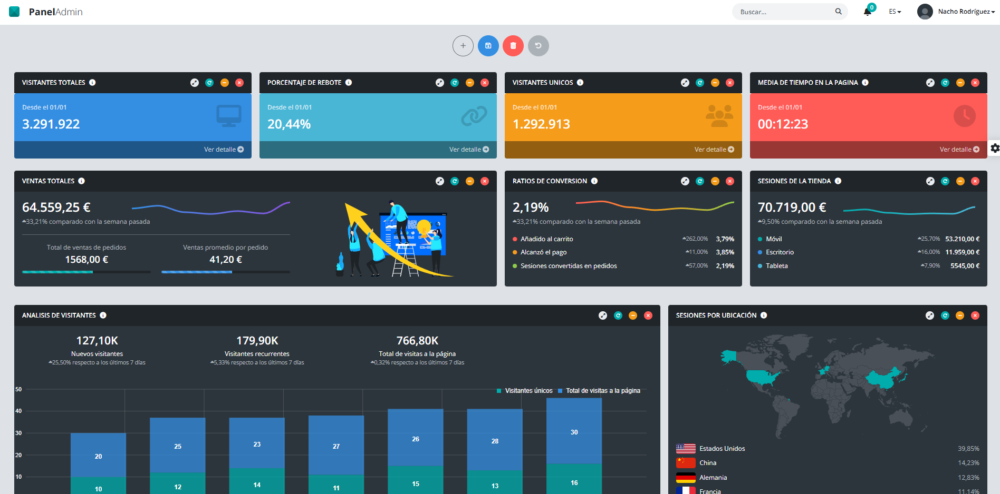

# 📘 dashboard_startup

🔶 Un dashboard o panel de control configurable por el usuario construido con **Vue 3**.
🔶 Permite utilizar vistas predefinidas o crear una propia añadiendo componentes de una lista y diseñando un dashboard personalizado.
🔶 El diseño puede ser guardado y persistirá hasta que el usuario lo elimine.
🔶 También poseé traducción en tiempo real, modo oscuro/claro, elección de colores base de una paleta y diversas configuraciones de la cabecera y barra de navegación a través de un panel de configuración lateral siempre accesible.
🔶 La temática del dashboard es la visualización de las estadisticas de una hipotética página de e-commerce destinada a la venta de dispositivos móviles y tablets, mostrando ratios de venta, canales, usuarios, zonas de venta, mensajes, etc.
🔶 Este proyecto forma parte de mi portfolio y está diseñado para mostrar una implementación profesional de un componente Vue autocontenible y desarrollado con fines exclusivamente didácticos.




---

## 🚀 Tecnologías utilizadas

- [Vue 3](https://vuejs.org/) + Composition API
- [Typescript](https://www.typescriptlang.org/) — Javascript superset
- [vue-i18n](https://github.com/intlify/vue-i18n-next) — Sistema de traducciones dinámico
- [localStorage API](https://developer.mozilla.org/en-US/docs/Web/API/Window/localStorage) — Persistencia de datos

---

## 🗂️ Estructura principal

```
src/
├── components/
│       ├── app
│       │   ├── Header.vue                  # Componente de cabecera
│       │   ├── Sidebar.vue                 # Componente barra lateral de navegación
│       │   └── ThemePanel.vue              # Componente panel lateral de configuración
│       └── widgets
│           ├── AvgTimeSite.vue             # Componente que muestra el tiempo promedio que los usuarios pasan en el sitio web durante una sesión
│           ├── BounceRate.vue              # Porcentaje de usuarios que abandonan la página sin interactuar o sin navegar a otras páginas del sitio
│           ├── ConversionRate.vue          # Porcentaje de sesiones que resultaron en pedidos del número total de sesiones
│           ├── MarketingCampaign.vue       # Componente que muestra campañas que se ejecutan para conseguir más clientes recurrentes
│           ├── NewComments.vue             # Componente que muestra la cantidad total de comentarios escritos en la página durante el día de hoy
│           ├── NewOrders.vue               # Componente que muestra la cantidad total de pedidos recibidos en la página durante el día de hoy
│           ├── SalesBySocial.vue           # Componente que muestra las ventas totales de la tienda online que provienen de un referente social
│           ├── StoreSessions.vue           # Número de sesiones en tu tienda online. Una sesión es un período de actividad continua de un visitante
│           ├── SessionByLocation.vue       # Mapa de los 5 países de procedencia de los usuarios con más número de sesiones en la tienda
│           ├── TodayVisits.vue             # Número de visitas que ha recibido el sitio web hasta ahora en el día de hoy
│           ├── TodayProfit.vue             # Cantidad total de ganancias obtenidas por el negocio durante el día de hoy
│           ├── TopProducts.vue             # Productos con más unidades vendidas. Incluye pedidos de todos los canales de venta
│           ├── TotalSales.vue              # Ventas netas (ventas brutas menos descuentos y devoluciones) más impuestos y envíos
│           ├── TotalVisitors.vue           # Número total de accesos a la página
│           ├── UniqueVisitors.vue          # Número de usuarios que visitan el sitio web durante un período específico, contados solo una vez
│           └── VisitorsAnalytics.vue       # Componente con gráfica para análisis de visitantes de la página en función de su tipo
├── views/
│   └── Dashboard.vue           # Vista del dashboard
├── assets/
│   └── flags/                  # Banderas de idiomas
├── i18n/
│   └── messages.ts             # Textos de la aplicación en español e inglés para cambio de idioma
├── App.vue                     # Componente raíz
├── main.ts                     # Punto de entrada
└── ...
```

---

## ✨ Funcionalidades

- 🎨 Tema claro / oscuro persistente
- 🌐 Soporte multilenguaje (Español / Inglés)
- ✅ Agregar, eliminar componentes al dashboard
- 📦 Configuración del dashboard persistente mediante `localStorage`
- 🔄 Guardado y restauración de layouts predefinidos
- 📱 Responsive y optimizado para móviles

---

## 🧩 Estructura del componente

- `template`: Vista con header, sidebar y panel de configuración
- `script setup`: Lógica clara, organizada por bloques funcionales
- `style`: Completamente comentado y contenido en el propio archivo
- ✅ No requiere ningún CSS externo adicional

---

## 🛠️ Instalación y uso

```bash
# Clona el repositorio
git clone https://github.com/KVOTHE73/dashboard-startup.git
cd dashboard_startup

# Instala dependencias
npm install

# Ejecuta en modo desarrollo
npm run dev
```

📅 Metainformación

📁 Proyecto: dashboard_startup

🧠 Autor: [Nacho Rodríguez](https://www.nacho-rodriguez.com)

📦 Tipo: Componente Vue 3 autocontenible

🎯 Finalidad: Portfolio personal / Demostración de habilidades frontend

🔗 Licencia: MIT

📣 Puedes ver una demo del proyecto en vivo aquí:
🟢 **[Ver demo online](https://kvothe73.github.io/dashboard-startup)**
